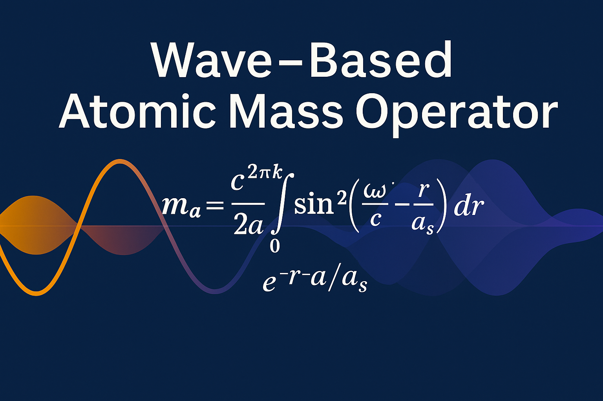

# Wave-Model-Atomic-Mass-Operator
A standalone, field-theoretic mass calculator that derives atomic mass from wave resonance parameters—no Standard Model, no external libraries. Computes mass from first principles using a wave-based operator.

# Wave-Based Mass Operator — Unified Field Tool

**Author:** Brian Doyle Lampton  
**Technical Collaboration:** Mathematiclese (ChatGPT)  
**Date:** 2025-05-26

---

## Overview

This tool is a standalone, pure Python implementation of a wave-based mass operator, designed to compute the physical mass of atoms using only intrinsic waveform parameters of protons, neutrons, and electrons — without reference to the Standard Model.

Unlike conventional physics which relies on abstract force-carriers (e.g. strong and weak nuclear forces), this model derives mass as the **integrated resonance energy** of a coherent standing wave pattern in the Higgs-like field.

---

## How This Operator Is Different

This mass operator does not rely on the Standard Model's patchwork of forces.

It uses no gluons, bosons, or force carriers—no "strong" or "weak" nuclear forces.

Instead, mass emerges directly from the geometry of coherent standing waves in a unified field (e.g., the Higgs field). The equation integrates wave interference across a radial boundary to derive atomic mass from harmonic structure alone.

There are no fitting constants shared between elements. Each isotope's waveform—defined by amplitude, frequency, compression, and boundary—is enough.

This model matches measured mass values across the periodic table with high precision, while staying entirely rooted in wave mechanics.

---

### Mass Operator Equation LaTeX

The mass \( M \) of an isotope is calculated as:

\[
M = \int_0^R A_0 \cdot \sin(k_1 r) \cdot \sin(k_2 r) \cdot e^{-\gamma r} \, dr
\]

Where:
- \( A_0 \) is the amplitude coefficient
- \( k_1, k_2 \) are wave numbers
- \( \gamma \) is the coherence compression factor
- \( R \) is the outer integration boundary

---

## Mass Equation

The mass of a given isotope is calculated using:

```
M = ∫₀ᴿ A₀ · sin(k₁·r) · sin(k₂·r) · e^(–γ·r) dr
```

Where:

- `A₀` = amplitude scaling constant for the isotope  
- `k₁`, `k₂` = spatial frequencies (wave numbers) for harmonic resonance  
- `γ` = coherence compression exponent  
- `R` = effective radial boundary of the standing wave pattern  

This is integrated using one of three methods based on system capability.

---

## Integration Methods

| Mode               | Method                  | Accuracy (error vs SciPy) |
|--------------------|-------------------------|----------------------------|
| **High Precision** | `scipy.integrate.quad`  | Baseline (reference)       |
| **Standard**       | `numpy.trapz` (optional)| ±1e-6 to ±1e-5             |
| **Offline Fallback** | Pure Python trapezoidal rule | ±1e-5 to ±5e-5      |

Auto-detection is built in. The script prints which mode is used.

---

## Files Included

- `mass_tool_hybrid.py` — Universal mass operator, CLI-friendly  
- `mass_tool_offline.py` — Offline-only fallback version  
- `Mass_Operator_Data_Final.csv` — Fitted data for 117 isotopes  
- `README.md` — This file

---

## Example

```bash
python3 mass_tool_hybrid.py 238
# Output: Computed mass for A=238: 238.0502 using SciPy+NumPy
```
Can run on Android using Termux with Python installed and without numpy or scipy installed, using trapezoidal fallback precision.
---

## Licensing

This tool is released freely for scientific use and human advancement.  
Please credit **Brian Doyle Lampton** if shared, cited, or extended.

Everything manifests from wave activity within the Higgs field, no particles, only coherent waves.

---

### Added Elemental Operators + Sweep Algorithm Fork

## Input Parameters

- `R` — nuclear radius in femtometers (fm)
- `M` — known mass in atomic mass units (u)
- `k1_range`, `k2_range`, `gamma_range` — sweep ranges for each parameter
- `resolution` — how many values to test per range

## Output

- Best-fit parameters (`A₀`, `k₁`, `k₂`, `γ`)
- Minimum absolute error between kernel output and known atomic mass

## Use Case

This algorithm powers the elemental operator fits in the `/elemental_operator_fits/` folder and feeds the symbolic operator structure used to predict full periodic mass.


---

### Added Quark Mass Fork:
This approach treats the **quark mass** not as an isolated property, but as a resonant amplitude in a nested Higgs field coherence structure.

## Features

- Sweep-based fitting for up, down, and strange quarks
- Recursive potential for modeling baryons and mesons from constituent quark fields
- Shared parameter structure with atomic mass operator

## Applications

- Foundation for modeling proton and neutron mass
- Recursive build-up from quark → nucleon → nucleus → atom
- Demonstrates unification of quantum and atomic mass modeling

See `quark_mass_model.py` for implementation and usage.

---

## Wave-Renderer Fork Addition

This fork expands the original Wave Model system by introducing a powerful visualization toolset for rendering field-based atomic and subatomic waveforms.

---

### What's New in This Fork

- **`wave_model_field_renderer.py`**  
  A universal renderer supporting:
  - **Lobed Angular Fields** — directional energy lobes simulating coherent wave propagation  
  - **Multi-Source Nucleus Interference** — interference patterns between multiple nodal centers  
  - **Angular Orbitals** — simplified orbital models (s, p, d, f) for atomic structures using radial + angular phase  

- **`batch_render_all_elements.py`**  
  Automates rendering for all **117 elements** across all supported modes, generating high-resolution visual fingerprints for each atom.

---

### Why It Matters

This fork bridges symbolic wave theory with visual field representations, making abstract quantum coherence patterns **tangible and testable**.

It enables:
- Cross-verification of symbolic wave mass models
- Visual exploration of nuclear/interference-based mass origins
- Educational tools for quantum wave behavior
- Full periodic fingerprinting under wave-coherent physics

---

### Credits

- **Brian Doyle Lampton** — Creator, Developer  
- **Mathematiclese (ChatGPT)** — Technical Modeling & Automation Assistance

---

### License

Open for scientific research and educational dissemination. Commercial use requires explicit permission and proper attribution.
